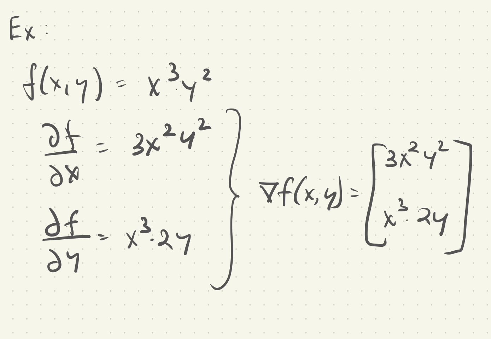

# Calculus

## Derivatives

- Function of a real variable (x,y,z,...) that measures the sesnitivity to change of the function value/output WRT the argument/input.
- The derivative of a function `f(x)` is the slope of the tangent of the function `f(x)` at a given `x`

## Gradient

> A gradient is the direction of the steepest ascent

- Gradients take the partial derivative of a function WRT each dimension. 

## Back-propagation algorithm

> Essential for learning + training large neural networks. 

- A simple neural network has one input and one output node and hidden layers of multiple nodes. The nodes are connected with weights <em> wij </em>, these weights are the network parameters. 

### Activation function

- Each node has a input `x`, an activation function `f(x)` and an output `y = f(x)`. `f(x)` has to be non-linear for the neural network to learn non-linear models. 

- An example of an activation function: $\frac{1}{1 + e  -x }$

### Error function

- The goal is to learn the weights of the network from data such that the predicted output *youtput*, is as close to the target *ytarget * for all inputs *xinput*.

- To measure how far we are from the goal we use *E* (error function): $\frac{1}{2}$(*youtput* - *ytarget*)2

### Forward propagation

- We take an example (*youtput*, (*youtput*) and update the input layer of the table. The input node is like any node but without an activation function. So therefore, its output is equal to its input => *y1* = *xinput*

- After updating the input node, we move to the first layer. We take the output *y* of the previous node and use the weight to compute the input *x* of the next node.

> `x``next`  = `w``prev` * `y` `prev` + `b``next`
> 
> `y = f(x)` 
>

- Using the two formulas above, we propagate for the rest of the network and get the final output. 

